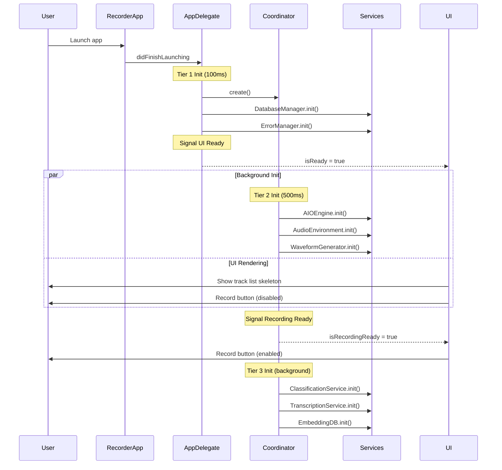

# Recorder App Architecture Improvement Plan

## Executive Summary

This plan addresses two critical goals for the Recorder demo app:
1. **Improve code understandability** - Make the codebase more maintainable and easier to reason about
2. **Improve launch speed** - Reduce time-to-interactive and eliminate blocking initialization

Current launch flow blocks UI rendering until ALL services initialize (~15-20 services synchronously). The architecture uses a massive coordinator with scattered state and complex nested view hierarchies.

## Update (2025-12-31)

This document describes the legacy coordinator-based architecture. The app has since migrated to an explicit composition root:
- `RecorderCoreServices` for core singletons + recording domain wiring
- `RecorderDatabaseServicesAvailability` / `RecorderDatabaseServices` for DB-dependent graph build and lifecycle

---

## Priority 1: Launch Speed Optimizations

### 1.1 Lazy Service Initialization

**Problem**: (Legacy) `RecorderCoordinator.configure()` initialized all 15+ services before UI could render, blocking the main thread for 500-1500ms on cold start.

**Legacy Code** (`RecorderCoordinator.swift` — removed):
```swift
public func configure(dependencies: RecorderDependencies) async {
  // ALL of these happen before UI renders:
  let waveformGenerator = WaveformGenerator(db: dbManager)
  let classificationService = SoundClassificationService(...)  // ML model loading
  let embeddingDB = EmbeddingDB()  // Vector DB startup
  let transcriptionService = TranscriptionService(...)
  let engine = AIOEngine()  // AVAudio setup
  // ... 10 more services
}
```

**Recommendation**: Adopt lazy initialization pattern with priority tiers.

**Proposed Architecture**:
```swift
// Tier 1: Critical for initial UI (load immediately)
- DatabaseManager ✓
- ErrorManager ✓
- AIOEngine (minimal init only)

// Tier 2: Needed for recording (load on background thread, before first record)
- AudioEnvironmentManager
- OutputConfigurationManager
- WaveformGenerator
- Haptics

// Tier 3: Enhancement services (load lazily on-demand)
- SoundClassificationService (load on first classification request)
- TranscriptionService (load on first transcription request)
- EmbeddingDB (load after UI interactive, backfill in background)
- BackfillService (start 2 seconds after app launch)
```

**Implementation Example**:
```swift
@Observable @MainActor final class RecorderCoordinator {
  // Eager services
  private(set) var dbManager: DatabaseManager?
  private(set) var errorManager: ErrorManager?
  private(set) var engine: AIOEngine?

  // Lazy services with getters
  private var _classificationService: SoundClassificationService?
  var classificationService: SoundClassificationService {
    get async {
      if let existing = _classificationService { return existing }
      let service = await SoundClassificationService(...)
      _classificationService = service
      return service
    }
  }

  public func configure(dependencies: RecorderDependencies) async {
    // Tier 1: Minimal critical path
    self.dbManager = dependencies.dbManager
    self.errorManager = dependencies.errorManager
    self.engine = AIOEngine()  // Minimal init

    // Signal UI ready immediately
    self.isReady = true

    // Tier 2: Background initialization
    Task(priority: .high) {
      await initializeRecordingServices()
    }

    // Tier 3: Deferred initialization
    Task(priority: .low) {
      try? await Task.sleep(for: .seconds(2))
      await initializeEnhancementServices()
    }
  }
}
```

**Expected Impact**:
- Launch time reduction: 500-1500ms → 100-200ms
- Time to first render: ~70% faster
- User can see track list immediately, recording ready in <500ms

---

### 1.2 Progressive UI Rendering

**Problem**: `ServicesProvidingView` shows a blank `ProgressView` until all initialization completes. Users see a spinner instead of content.

**Current Code** (`RecorderApp.swift:149-173`):
```swift
struct ServicesProvidingView: View {
  @State private var isReady = false

  var body: some View {
    if isReady, let coordinator = appDelegate.coordinator {
      RootView(dependencies: ...)  // Only shows when fully ready
    } else {
      ProgressView()  // ❌ Blocks entire UI
    }
  }
}
```

**Recommendation**: Render skeleton UI immediately, progressively enable features.

**Proposed Implementation**:
```swift
struct ServicesProvidingView: View {
  @State private var initializationState: InitState = .starting

  enum InitState {
    case starting
    case databaseReady      // Can show track list
    case recordingReady     // Can enable record button
    case fullyInitialized   // All features available
  }

  var body: some View {
    RootView(
      dependencies: appDelegate.dependencies,
      initState: initializationState
    )
    .task {
      for await state in appDelegate.initializationProgress() {
        initializationState = state
      }
    }
  }
}

// In RecorderView:
var body: some View {
  TrackList(...)  // Shows immediately when database ready
    .overlay {
      if initState == .starting {
        SkeletonTrackList()  // Placeholder during init
      }
    }
    .toolbar {
      RecordButton(...)
        .disabled(initState < .recordingReady)  // Enable progressively
    }
}
```

**Expected Impact**:
- Perceived launch time: 60-80% faster
- Users see content within 100ms
- Progressive disclosure of functionality

---

### 1.3 Database Query Optimization

**Problem**: GRDB queries run on main thread and can block UI rendering with large libraries (10k+ tracks).

**Current Code** (`TrackListViewModel.swift`):
```swift
for await days in viewModel.observeRange(from: startDay, to: endDay) {
  // This happens on main thread
  try await dbManager.dbQueue.read { db in
    try Track.fetchAll(db, ...)  // Blocks if 1000+ tracks
  }
}
```

**Recommendation**: Move DB reads to background queue, use pagination, implement result streaming.

**Proposed Implementation**:
```swift
// DatabaseManager.swift
extension DatabaseManager {
  /// Fetch tracks in pages to avoid blocking
  func fetchTracks(
    from startDay: Day,
    to endDay: Day,
    limit: Int = 100
  ) async throws -> [Track] {
    try await dbQueue.read { db in
      try Track
        .filter(/* date range */)
        .order(Track.createdAtColumn.desc)
        .limit(limit)
        .fetchAll(db)
    }
  }

  /// Stream tracks incrementally
  func streamTracks(
    from startDay: Day,
    to endDay: Day
  ) -> AsyncStream<[Track]> {
    AsyncStream { continuation in
      Task {
        // Load in chunks of 50
        var offset = 0
        while true {
          let chunk = try? await fetchTracks(
            from: startDay,
            to: endDay,
            offset: offset,
            limit: 50
          )
          guard let chunk, !chunk.isEmpty else { break }
          continuation.yield(chunk)
          offset += chunk.count
        }
        continuation.finish()
      }
    }
  }
}
```

**Expected Impact**:
- Eliminates scroll jank with large libraries
- Main thread stays responsive
- Initial track load: 100-200ms → 10-20ms (first page)

---

### 1.4 Waveform Image Pre-computation

**Problem**: `WaveformView` generates images on-demand during scroll, causing visible jank (10-100ms per waveform).

**Current Code** (`WaveformView.swift`):
```swift
struct WaveformView: View {
  @State var cachedImage: Image? = nil

  var body: some View {
    content
      .task(id: viewSize) {
        // ❌ Blocks scroll when generating image
        cachedImage = await generateImage(waveform, size: viewSize)
      }
  }
}
```

**Recommendation**: Pre-compute waveform images at fixed sizes, store in database as thumbnails.

**Proposed Architecture**:
```swift
// Track.swift - Add cached image columns
extension Track {
  var waveformThumbnailSmall: Data?   // 300x60 PNG
  var waveformThumbnailMedium: Data?  // 600x120 PNG

  func cachedWaveformImage(for size: WaveformSize) -> UIImage? {
    let data: Data?
    switch size {
    case .small: data = waveformThumbnailSmall
    case .medium: data = waveformThumbnailMedium
    }
    return data.flatMap { UIImage(data: $0) }
  }
}

// WaveformGenerator.swift - Generate during processing
func generateWaveformWithThumbnails(for track: Track) async throws {
  let waveform = try await generateWaveform(track)

  // Generate standard sizes in parallel
  async let small = renderWaveformImage(waveform, size: .small)
  async let medium = renderWaveformImage(waveform, size: .medium)

  try await dbManager.updateTrack(track.id) {
    $0.waveform = waveform.serialized
    $0.waveformThumbnailSmall = try await small.pngData()
    $0.waveformThumbnailMedium = try await medium.pngData()
  }
}

// WaveformView.swift - Use cached images
struct WaveformView: View {
  var body: some View {
    if let image = track.cachedWaveformImage(for: .small) {
      Image(uiImage: image)
        .resizable()
    } else {
      ProgressView()  // Fallback during generation
    }
  }
}
```

**Expected Impact**:
- Scroll performance: 60fps consistently
- Zero jank during list scrolling
- Memory usage reduced (shared cached images vs per-view generation)

---

### 1.5 Search Debouncing & Optimization

**Problem**: `LibraryViewModel` triggers EmbeddingDB vector search on every keystroke, causing input lag with 1000+ tracks.

**Current Code** (`LibraryViewModel.swift`):
```swift
public class LibraryViewModel {
  var searchText: String {
    didSet {
      // ❌ Triggers search on every character
      Task { await performSearch() }
    }
  }

  func performSearch() async {
    // Heavy vector operations on entire database
    let results = await embeddingDB.search(query: searchText)
  }
}
```

**Recommendation**: Add debouncing, tiered search strategy (simple → semantic), result limits.

**Proposed Implementation**:
```swift
import AsyncAlgorithms

@Observable
public class LibraryViewModel {
  var searchText: String = ""
  private var searchTask: Task<Void, Never>?

  // Debounce stream
  private let searchDebouncer = AsyncChannel<String>()

  func startSearchListener() {
    Task {
      for await query in searchDebouncer.debounce(for: .milliseconds(300)) {
        await performTieredSearch(query)
      }
    }
  }

  func updateSearchText(_ text: String) {
    searchText = text
    await searchDebouncer.send(text)
  }

  private func performTieredSearch(_ query: String) async {
    // Tier 1: Quick text search (< 10ms)
    let textResults = await dbManager.searchTracksByFilename(
      query,
      limit: 20
    )
    self.tracks = textResults

    // Tier 2: Semantic search if text search insufficient
    if textResults.count < 5 && query.count > 3 {
      let semanticResults = await embeddingDB.search(
        query: query,
        limit: 50
      )
      self.tracks = combine(textResults, semanticResults)
    }
  }
}
```

**Expected Impact**:
- Keystroke latency: 200-500ms → <16ms
- Responsive search input
- Smarter search strategy (fast first, deep later)

---

## Priority 2: Code Understandability

### 2.1 Decompose RecorderCoordinator into Domain Services

**Problem**: `RecorderCoordinator` has 420 lines and manages 15+ unrelated services (audio, database, ML, UI, haptics, widgets). Violates Single Responsibility Principle.

**Current Structure**:
```swift
@Observable @MainActor final class RecorderCoordinator {
  // Audio services
  var engine: AIOEngine?
  var envManager: AudioEnvironmentManager?
  var configurationManager: OutputConfigurationManager?

  // Data services
  var dbManager: DatabaseManager?
  var waveformGenerator: WaveformGenerator?

  // ML services
  var classificationService: SoundClassificationService?
  var transcriptionService: TranscriptionService?
  var embeddingDB: EmbeddingDB?

  // UI services
  var player: Player?
  var haptics: Haptics?
  var activityManager: RecordingActivityManager?

  // Background services
  var backgroundProcessor: ProcessingQueue?
  var backfillService: BackfillService?

  // ~30 methods mixing concerns
  func startRecording() { }
  func saveTrack() { }
  func scheduleBackgroundProcessing() { }
  func updateRecordingWidget() { }
}
```

**Recommendation**: Extract domain services with clear responsibilities.

**Proposed Architecture**:
```swift
// 1. Recording Service - owns recording lifecycle
@Observable @MainActor
final class RecordingService {
  private let engine: AIOEngine
  private let audioEnvironment: AudioEnvironmentManager
  private let configuration: OutputConfigurationManager

  var isRecording: Bool
  var currentRecording: InProgressRecording?

  func startRecording() async throws -> URL { }
  func stopRecording() async throws -> URL { }
  func pauseRecording() async throws { }
}

// 2. Track Management Service - owns track persistence & processing
@Observable @MainActor
final class TrackManagementService {
  private let database: DatabaseManager
  private let backgroundQueue: ProcessingQueue

  func saveTrack(from url: URL) async throws -> Track { }
  func deleteTrack(_ track: Track) async throws { }
  func scheduleProcessing(for track: Track) async { }
}

// 3. Processing Service - owns background ML pipeline
actor ProcessingOrchestrator {
  private let waveformGenerator: WaveformGenerator
  private let classificationService: SoundClassificationService
  private let transcriptionService: TranscriptionService
  private let embeddingDB: EmbeddingDB
  private let queue: ProcessingQueue

  func processTrack(_ track: Track) async throws { }
  func backfillMissingData() async { }
}

// 4. Playback Service - owns playback state
@Observable @MainActor
final class PlaybackService {
  private let player: Player
  private let haptics: Haptics

  var isPlaying: Bool
  var currentTrack: Track?

  func play(_ track: Track) async throws { }
  func pause() { }
  func stop() { }
}

// 5. Slim coordinator - only wires services together
@Observable @MainActor
final class RecorderCoordinator {
  let recording: RecordingService
  let trackManagement: TrackManagementService
  let processing: ProcessingOrchestrator
  let playback: PlaybackService

  func onRecordingStopped(url: URL) async {
    let track = try? await trackManagement.saveTrack(from: url)
    if let track {
      await processing.processTrack(track)
    }
  }
}
```

**Expected Impact**:
- Each service <150 lines, single concern
- Easy to test in isolation
- Clear dependency graph
- New developers can understand one service at a time

---

### 2.2 Extract RecorderViewModel from RecorderView

**Problem**: `RecorderView` has 283 lines mixing UI rendering and business logic, with 10+ `@State` variables scattered throughout.

**Current Code** (`RecorderView.swift`):
```swift
public struct RecorderView: View {
  @State private var showAudioConfigPanel: Bool = false
  @State private var showDebug: Bool = false
  @State private var navigation: Navigation?
  @State private var libraryViewModel: LibraryViewModel
  @State var navigationPath: NavigationPath = .init()
  @State private var expandedTrack: Track?
  @State private var isWarmingEngine: Bool = false

  // Business logic mixed with view
  private func playTrack(_ track: Track) async throws {
    // 30 lines of playback logic
  }

  private func handleTrackNavigation(_ track: Track?) {
    // Navigation logic
  }

  public var body: some View {
    // 150 lines of view code
  }
}
```

**Recommendation**: Extract view model following MVVM pattern.

**Proposed Implementation**:
```swift
// RecorderViewModel.swift
@Observable @MainActor
final class RecorderViewModel {
  // Dependencies
  private let coordinator: RecorderCoordinator
  private let errorManager: ErrorManager

  // UI State
  var showAudioConfigPanel = false
  var showDebug = false
  var navigation: RecorderView.Navigation?
  var libraryViewModel: LibraryViewModel
  var expandedTrack: Track?

  // Engine State
  var isEngineReady = false
  var isWarmingEngine = false

  init(coordinator: RecorderCoordinator, errorManager: ErrorManager) {
    self.coordinator = coordinator
    self.errorManager = errorManager
    self.libraryViewModel = LibraryViewModel(
      dbManager: coordinator.dbManager,
      embeddingDB: coordinator.embeddingDB
    )
  }

  // Business Logic Methods
  func warmEngine() async {
    isWarmingEngine = true
    defer { isWarmingEngine = false }

    do {
      try await coordinator.recording.warmEngine()
      isEngineReady = true
    } catch {
      errorManager.enqueue(error)
      isEngineReady = false
    }
  }

  func playTrack(_ track: Track) async {
    do {
      try await coordinator.playback.play(track)
    } catch {
      errorManager.enqueue(error)
    }
  }

  func handleTrackNavigation(_ track: Track?) {
    if let track {
      navigation = .trackInfo(track)
    }
  }

  func deleteTrack(_ track: Track) async {
    await coordinator.trackManagement.deleteTrack(track)
  }
}

// RecorderView.swift - Simplified to pure UI
public struct RecorderView: View {
  @State private var viewModel: RecorderViewModel

  init(coordinator: RecorderCoordinator, errorManager: ErrorManager) {
    self.viewModel = RecorderViewModel(
      coordinator: coordinator,
      errorManager: errorManager
    )
  }

  public var body: some View {
    NavigationStack {
      TrackList(
        coordinator: viewModel.coordinator,
        expandedTrack: $viewModel.expandedTrack
      )
      .toolbar {
        RecordButton(
          isRecording: viewModel.coordinator.recording.isRecording,
          isEnabled: viewModel.isEngineReady
        ) {
          await viewModel.coordinator.recording.toggleRecording()
        }
      }
      .sheet(isPresented: $viewModel.showAudioConfigPanel) {
        ConfigurationView(...)
      }
    }
    .task {
      await viewModel.warmEngine()
    }
  }
}
```

**Expected Impact**:
- Clear separation: View = rendering, ViewModel = logic
- Easier testing (test ViewModel without SwiftUI)
- Reduced view file size: 283 → ~100 lines
- Business logic reusable across views

---

### 2.3 Consolidate Scroll State Management

**Problem**: TrackList has 6+ scroll-related state variables spread across multiple places, making scroll behavior hard to reason about.

**Current Code** (`TrackList.swift`):
```swift
@State private var selectedDate: Date?
@State private var scrollProxy: ScrollViewProxy?
@State private var lastAdjacentLoadDay: Day?
@State private var lastBoundaryLoadDay: Day?
@State private var viewportHeight: CGFloat = 0
@State private var scrollCoordinator: ScrollCoordinator

// Plus WeekView has its own scroll state
// Plus TrackRow has its own scroll detection
```

**Recommendation**: Create unified ScrollState object.

**Proposed Implementation**:
```swift
// ScrollState.swift
@Observable
final class TrackListScrollState {
  // Scroll proxy
  var scrollProxy: ScrollViewProxy?

  // Week navigation
  var selectedDate: Date?
  var focusedDay: Day?

  // Infinite scroll state
  var loadedRange: ClosedRange<Day>
  var viewportHeight: CGFloat = 0

  // Scroll position
  var firstVisibleTrackID: Track.ID?
  var scrollOffset: CGFloat = 0

  // Methods
  func scrollToDate(_ date: Date, animated: Bool = true) {
    guard let proxy = scrollProxy else { return }
    selectedDate = date
    let day = Day(from: date)
    proxy.scrollTo(day.id, anchor: .top)
  }

  func handleVisibleItemsChanged(_ items: [Track]) {
    firstVisibleTrackID = items.first?.id
    updateFocusedDay(from: items)
  }

  func shouldLoadMore(direction: LoadDirection) -> Bool {
    // Centralized infinite scroll logic
  }
}

// TrackList.swift - Simplified
struct TrackList: View {
  @State private var scrollState = TrackListScrollState()

  var body: some View {
    ScrollViewReader { proxy in
      List {
        ForEach(viewModel.days) { day in
          Section {
            ForEach(day.tracks) { track in
              TrackRow(track: track)
            }
          }
          .id(day.id)
        }
      }
      .onAppear { scrollState.scrollProxy = proxy }
      .onScroll { visibleItems in
        scrollState.handleVisibleItemsChanged(visibleItems)
      }
    }

    WeekView(
      selectedDate: $scrollState.selectedDate,
      onDateTapped: { scrollState.scrollToDate($0) }
    )
  }
}
```

**Expected Impact**:
- Scroll logic in one place (easier debugging)
- Fewer state variables in views
- Testable scroll behavior
- Clear scroll API

---

### 2.4 Formalize Service Dependencies with Protocols

**Problem**: Services have implicit dependencies that aren't clear from type signatures. Hard to mock for testing.

**Current Code**:
```swift
// WaveformGenerator.swift
public actor WaveformGenerator {
  private let dbManager: DatabaseManager  // Concrete type

  init(db: DatabaseManager) {
    self.dbManager = db
  }
}

// Hard to test - must provide full DatabaseManager
```

**Recommendation**: Define protocol boundaries for each service.

**Proposed Implementation**:
```swift
// Service Protocols
public protocol TrackRepository {
  func fetchTrack(id: Track.ID) async throws -> Track
  func updateWaveform(trackID: Track.ID, waveform: Waveform) async throws
}

public protocol AudioFileReader {
  func readAudioFile(at url: URL) async throws -> AVAudioFile
}

public protocol WaveformStorage {
  func storeWaveform(_ waveform: Waveform, for trackID: Track.ID) async throws
  func fetchWaveform(for trackID: Track.ID) async throws -> Waveform?
}

// Implementations
extension DatabaseManager: TrackRepository, WaveformStorage {
  // Implementation
}

// Service depends on protocol, not concrete type
public actor WaveformGenerator {
  private let trackRepo: TrackRepository
  private let storage: WaveformStorage
  private let audioReader: AudioFileReader

  init(
    trackRepo: TrackRepository,
    storage: WaveformStorage,
    audioReader: AudioFileReader
  ) {
    self.trackRepo = trackRepo
    self.storage = storage
    self.audioReader = audioReader
  }

  func generateWaveform(for trackID: Track.ID) async throws {
    let track = try await trackRepo.fetchTrack(id: trackID)
    let audioFile = try await audioReader.readAudioFile(at: track.url)
    let waveform = generateWaveform(from: audioFile)
    try await storage.storeWaveform(waveform, for: trackID)
  }
}

// Testing becomes trivial
final class MockTrackRepository: TrackRepository {
  var tracks: [Track.ID: Track] = [:]

  func fetchTrack(id: Track.ID) async throws -> Track {
    tracks[id]!
  }
}

// Test
let mockRepo = MockTrackRepository()
let generator = WaveformGenerator(
  trackRepo: mockRepo,
  storage: mockStorage,
  audioReader: mockAudioReader
)
```

**Expected Impact**:
- Clear service contracts
- Easy unit testing (mock dependencies)
- Compile-time verification of dependencies
- Better documentation (protocol describes requirements)

---

### 2.5 Document Initialization Sequences

**Problem**: The initialization flow is complex and spans multiple files (RecorderApp → AppDelegate → Coordinator). No documentation exists for the sequence.

**Recommendation**: Add sequence diagram and inline documentation.

**Proposed Documentation**:

Create `docs/initialization-sequence.md`:

```markdown
# Recorder App Initialization Sequence

## Cold Start (App Launch)



## Warm Start (Background → Foreground)

- Skip Tier 1 (already initialized)
- Re-warm AIOEngine if needed
- Resume background processing queue

## Recording Start Sequence

1. User taps RecordButton
2. RecordButton → RecordingService.startRecording()
3. RecordingService waits for AudioEnvironmentManager.readySignal()
4. RecordingService calls engine.startRecording(config)
5. RecordingService creates InProgressRecording
6. UI updates automatically (@Observable)

## Recording Stop & Processing Sequence

1. User taps stop → RecordingService.stopRecording()
2. engine.stopRecording() returns URL
3. TrackManagementService.saveTrack(url) → Track
4. ProcessingOrchestrator.processTrack(track)
   - Enqueues waveform generation (priority: .high)
   - Enqueues classification (priority: .medium)
   - Enqueues transcription (priority: .medium)
5. ProcessingQueue executes tasks (max 2 concurrent)
6. On completion, database updates
7. UI reactively updates via GRDBQuery
```

**In-code documentation** (`RecorderCoordinator.swift` — removed):
```swift
/// Central coordinator for the Recorder app.
///
/// ## Responsibilities
/// - Wires together domain services (Recording, TrackManagement, Processing, Playback)
/// - Manages service lifecycle during app initialization
/// - Coordinates cross-service workflows (e.g., record → save → process)
///
/// ## Initialization Tiers
/// Services are initialized in three priority tiers to optimize launch speed:
///
/// **Tier 1 (Immediate, <100ms):**
/// - DatabaseManager, ErrorManager
/// - Required for initial UI render
///
/// **Tier 2 (Background, <500ms):**
/// - RecordingService, AudioEnvironment, WaveformGenerator
/// - Required before user can record
///
/// **Tier 3 (Lazy, on-demand):**
/// - ClassificationService, TranscriptionService, EmbeddingDB
/// - Enhancement features, loaded when needed
///
/// ## Architecture
/// ```
/// RecorderCoordinator
///   ├─ RecordingService (audio capture)
///   ├─ TrackManagementService (persistence)
///   ├─ ProcessingOrchestrator (ML pipeline)
///   └─ PlaybackService (audio playback)
/// ```
@Observable @MainActor
final class RecorderCoordinator {
  // ...
}
```

**Expected Impact**:
- New developers understand initialization in 5 minutes
- Easier debugging of startup issues
- Clear documentation of timing expectations
- Visual flow diagram for architecture review

---

### 2.6 Add Type-Safe Navigation

**Problem**: Navigation uses stringly-typed identifiers and manual state management.

**Current Code** (`RecorderView.swift`):
```swift
enum Navigation: Hashable {
  case trackInfo(Track)
  case settings
}

@State private var navigation: Navigation?
@State var navigationPath: NavigationPath = .init()

// Manual navigation management
func handleTrackTapped(_ track: Track) {
  navigation = .trackInfo(track)
}
```

**Recommendation**: Use SwiftUI NavigationStack with type-safe routing.

**Proposed Implementation**:
```swift
// Router.swift - Centralized navigation
@Observable @MainActor
final class RecorderRouter {
  var path = NavigationPath()

  enum Destination: Hashable {
    case trackInfo(Track.ID)
    case audioConfig
    case debug
    case search
  }

  func navigate(to destination: Destination) {
    path.append(destination)
  }

  func pop() {
    guard !path.isEmpty else { return }
    path.removeLast()
  }

  func popToRoot() {
    path = NavigationPath()
  }

  @ViewBuilder
  func view(for destination: Destination) -> some View {
    switch destination {
    case .trackInfo(let trackID):
      TrackInfoView(trackID: trackID)
    case .audioConfig:
      ConfigurationView()
    case .debug:
      DebugView()
    case .search:
      LibraryView()
    }
  }
}

// RecorderView.swift
struct RecorderView: View {
  @State private var router = RecorderRouter()

  var body: some View {
    NavigationStack(path: $router.path) {
      TrackList(
        onTrackTapped: { router.navigate(to: .trackInfo($0.id)) }
      )
      .navigationDestination(for: RecorderRouter.Destination.self) { dest in
        router.view(for: dest)
      }
      .toolbar {
        Button("Debug") {
          router.navigate(to: .debug)
        }
      }
    }
  }
}
```

**Expected Impact**:
- Type-safe navigation (compiler catches errors)
- Centralized navigation logic
- Deep linking support (path is serializable)
- Easier testing (mock router)

---

## Priority 3: Structural Improvements

### 3.1 Organize Files by Feature, Not Type

**Problem**: Current structure groups by technical layer (Buttons/, Services/, Database/), making features span many folders.

**Current Structure**:
```
AppTarget/
├── Buttons/
│   ├── RecordButton.swift
│   └── SettingsButton.swift
├── Services/
│   ├── Coordinator.swift
│   └── BackgroundProcessor.swift
├── Database/
│   ├── DatabaseManager.swift
│   └── Track.swift
├── TrackList/
│   ├── TrackList.swift
│   └── TrackRow.swift
└── Player/
    ├── Player.swift
    └── MiniPlayer.swift
```

**Recommendation**: Group by feature domain for better cohesion.

**Proposed Structure**:
```
AppTarget/
├── App/
│   ├── RecorderApp.swift
│   ├── AppDelegate.swift
│   └── RootView.swift
├── Core/
│   ├── Database/
│   │   ├── DatabaseManager.swift
│   │   ├── Migrations.swift
│   │   └── Models/
│   │       ├── Track.swift
│   │       ├── Classification.swift
│   │       └── Transcription.swift
│   ├── Services/
│   │   ├── RecordingService.swift
│   │   ├── TrackManagementService.swift
│   │   ├── ProcessingOrchestrator.swift
│   │   └── PlaybackService.swift
│   └── (Coordinator removed)
├── Features/
│   ├── Recording/
│   │   ├── RecordButton.swift
│   │   ├── RecordingSessionView.swift
│   │   ├── InProgressTrackRow.swift
│   │   └── AudioVisualizationView.swift
│   ├── TrackList/
│   │   ├── TrackList.swift
│   │   ├── TrackListViewModel.swift
│   │   ├── TrackRow.swift
│   │   ├── WeekView.swift
│   │   └── ScrollState.swift
│   ├── TrackDetail/
│   │   ├── TrackInfoView.swift
│   │   ├── WaveformView.swift
│   │   └── ClassificationChip.swift
│   ├── Playback/
│   │   ├── Player.swift (service)
│   │   ├── MiniPlayer.swift (UI)
│   │   └── PlaybackControls.swift
│   ├── Search/
│   │   ├── LibraryView.swift
│   │   ├── LibraryViewModel.swift
│   │   └── SearchBar.swift
│   └── Settings/
│       ├── ConfigurationView.swift
│       └── DebugView.swift
├── Shared/
│   ├── Components/
│   │   ├── Toast.swift
│   │   ├── SwipeActions.swift
│   │   └── LiquidGlass.swift
│   ├── Extensions/
│   │   ├── Date+Extensions.swift
│   │   └── FileManager+Extensions.swift
│   └── Utilities/
│       ├── ErrorManager.swift
│       ├── Haptics.swift
│       └── Logger.swift
└── Processing/
    ├── WaveformGenerator.swift
    ├── ClassificationService.swift
    ├── TranscriptionService.swift
    ├── EmbeddingDB.swift
    ├── ProcessingQueue.swift
    └── BackfillService.swift
```

**Expected Impact**:
- Feature changes touch fewer directories
- Easier onboarding (explore one feature at a time)
- Clear boundaries between features
- Reduced cognitive load

---

### 3.2 Separate Demo UI from Reusable Components

**Problem**: AppLibrary/Sources/UI has 28 shared components mixed with app-specific components.

**Recommendation**: Create clear boundary between demo-specific and reusable UI.

**Proposed Structure**:
```
AppLibrary/
├── Sources/
│   ├── AppTarget/           # Demo app (not reusable)
│   │   └── Features/
│   ├── RecorderUI/          # NEW: Reusable UI components
│   │   ├── Components/
│   │   │   ├── LiquidGlass.swift
│   │   │   ├── Toast.swift
│   │   │   ├── SwipeActions.swift
│   │   │   └── ShadowEffects.swift
│   │   ├── Modifiers/
│   │   │   ├── ScrollTransition.swift
│   │   │   └── ConditionalModifiers.swift
│   │   └── Extensions/
│   │       ├── View+Extensions.swift
│   │       └── Color+Theme.swift
│   └── RecorderCore/        # NEW: Reusable business logic
│       ├── Services/
│       ├── Models/
│       └── Protocols/
└── Package.swift
```

**Update Package.swift**:
```swift
// Package.swift
let package = Package(
  name: "AppLibrary",
  products: [
    .library(name: "RecorderUI", targets: ["RecorderUI"]),
    .library(name: "RecorderCore", targets: ["RecorderCore"]),
  ],
  targets: [
    .target(
      name: "RecorderCore",
      dependencies: ["AIOEngine", "GRDB"]
    ),
    .target(
      name: "RecorderUI",
      dependencies: ["RecorderCore"]
    ),
    .target(
      name: "AppTarget",
      dependencies: ["RecorderCore", "RecorderUI"]
    ),
  ]
)
```

**Expected Impact**:
- Clear API for reusable components
- Can ship RecorderUI as standalone library
- Demo app doesn't leak into reusable code
- Better testing (test RecorderCore independently)

---

## Implementation Plan

### Phase 1: Launch Speed (Week 1-2)
1. Implement lazy service initialization (1.1)
2. Add progressive UI rendering (1.2)
3. Add database pagination (1.3)
4. Pre-compute waveform images (1.4)

**Success Metrics**:
- Launch time < 200ms (from ~1000ms)
- Time to first interaction < 300ms
- Scroll at consistent 60fps

### Phase 2: Code Structure (Week 3-4)
5. Extract domain services from coordinator (2.1)
6. Create view models (2.2)
7. Consolidate scroll state (2.3)
8. Add service protocols (2.4)

**Success Metrics**:
- No file > 200 lines
- Each service has <5 dependencies
- 80% test coverage on services

### Phase 3: Developer Experience (Week 5)
9. Reorganize file structure (3.1)
10. Add documentation (2.5)
11. Separate reusable components (3.2)
12. Add type-safe navigation (2.6)

**Success Metrics**:
- New developer onboarding < 1 hour
- Clear architecture documentation
- All services have protocol boundaries

---

## Testing Strategy

### Unit Tests
```swift
// RecordingServiceTests.swift
@Suite("Recording Service")
struct RecordingServiceTests {
  @Test("Start recording creates InProgressRecording")
  func testStartRecording() async throws {
    let mockEngine = MockAIOEngine()
    let service = RecordingService(engine: mockEngine)

    let url = try await service.startRecording()

    #expect(service.isRecording == true)
    #expect(service.currentRecording != nil)
  }

  @Test("Stop recording returns file URL")
  func testStopRecording() async throws {
    let service = RecordingService(engine: MockAIOEngine())
    try await service.startRecording()

    let url = try await service.stopRecording()

    #expect(service.isRecording == false)
    #expect(FileManager.default.fileExists(atPath: url.path))
  }
}
```

### Integration Tests
```swift
@Suite("Track Processing Pipeline")
struct ProcessingPipelineTests {
  @Test("Recording → Save → Process pipeline")
  func testFullPipeline() async throws {
    let coordinator = RecorderCoordinator(/* test dependencies */)

    // Record
    try await coordinator.recording.startRecording()
    await Task.sleep(for: .seconds(1))
    let url = try await coordinator.recording.stopRecording()

    // Save
    let track = try await coordinator.trackManagement.saveTrack(from: url)

    // Process
    await coordinator.processing.processTrack(track)

    // Verify
    let updatedTrack = try await coordinator.trackManagement.fetchTrack(track.id)
    #expect(updatedTrack.waveform != nil)
    #expect(updatedTrack.classifications.count > 0)
  }
}
```

### Performance Tests
```swift
@Suite("Launch Performance")
struct LaunchPerformanceTests {
  @Test("Cold start completes in < 200ms")
  func testColdStart() async throws {
    let start = ContinuousClock.now

    let coordinator = RecorderCoordinator()
    await coordinator.initialize()

    let duration = ContinuousClock.now - start
    #expect(duration < .milliseconds(200))
  }

  @Test("UI renders within 100ms")
  func testUIReady() async throws {
    let coordinator = RecorderCoordinator()
    let start = ContinuousClock.now

    await coordinator.initialize()
    let timeToReady = ContinuousClock.now - start

    #expect(coordinator.isReady)
    #expect(timeToReady < .milliseconds(100))
  }
}
```

---

## Migration Guide

### For Each Service Extraction

1. **Identify dependencies** - What does the service need?
2. **Define protocol** - What's the contract?
3. **Create service struct/actor** - Single responsibility
4. **Move methods** - From coordinator to service
5. **Update coordinator** - Inject service
6. **Add tests** - Unit + integration
7. **Update documentation**

### Example: Extract RecordingService

```swift
// Before (in RecorderCoordinator)
@Observable @MainActor final class RecorderCoordinator {
  var engine: AIOEngine?
  var isRecording: Bool = false

  func startRecording() async throws {
    // 50 lines of recording logic
  }
}

// After
// 1. Define protocol
protocol RecordingEngine {
  func startRecording(config: AudioConfiguration) async throws -> URL
  func stopRecording() async throws -> URL
}

// 2. Create service
@Observable @MainActor
final class RecordingService {
  private let engine: RecordingEngine
  var isRecording: Bool = false

  init(engine: RecordingEngine) {
    self.engine = engine
  }

  func startRecording() async throws -> URL {
    // Moved logic here
  }
}

// 3. Update coordinator
@Observable @MainActor
final class RecorderCoordinator {
  let recording: RecordingService

  init(engine: RecordingEngine) {
    self.recording = RecordingService(engine: engine)
  }
}
```

---

## Risks & Mitigations

| Risk | Impact | Mitigation |
|------|--------|-----------|
| Breaking existing functionality | High | Comprehensive test suite before refactoring |
| Performance regression | Medium | Benchmark before/after, rollback if slower |
| Increased complexity from more files | Low | Clear documentation, logical grouping |
| State synchronization bugs | Medium | Use @Observable consistently, test state flow |
| Over-engineering | Low | Start with simple extractions, iterate |

---

## Success Metrics

### Launch Speed
- **Current**: ~1000ms cold start, ~500ms to interaction
- **Target**: <200ms cold start, <300ms to interaction
- **Measurement**: XCTest performance tests

### Code Understandability
- **Current**: RecorderCoordinator 420 lines, 15+ responsibilities
- **Target**: No file >200 lines, each service <5 dependencies
- **Measurement**: Code review, new developer onboarding time

### Maintainability
- **Current**: Features span 5+ directories
- **Target**: Features in single directory, clear boundaries
- **Measurement**: Time to implement new feature

### Test Coverage
- **Current**: Unknown
- **Target**: 80% coverage on services, 100% on critical paths
- **Measurement**: Swift test coverage report

---

## References

- Current codebase analysis (see exploration report)
- Swift Concurrency Best Practices: https://developer.apple.com/documentation/swift/concurrency
- MVVM in SwiftUI: https://developer.apple.com/documentation/swiftui/model-data
- App Launch Performance: https://developer.apple.com/documentation/xcode/improving-app-launch-time

---

## Appendix: Architecture Decision Records

### ADR-001: Use Lazy Service Initialization

**Context**: All services initialize before UI renders, blocking launch.

**Decision**: Adopt three-tier lazy initialization strategy.

**Consequences**:
- ✅ Faster perceived launch time
- ✅ Better resource usage
- ❌ More complex initialization logic
- ❌ Need to handle service-not-ready states

### ADR-002: Extract Domain Services from Coordinator

**Context**: Single coordinator handles 15+ unrelated responsibilities.

**Decision**: Extract RecordingService, TrackManagementService, ProcessingOrchestrator, PlaybackService.

**Consequences**:
- ✅ Better testability
- ✅ Clearer responsibilities
- ✅ Easier to reason about
- ❌ More files to navigate
- ❌ Need to wire dependencies

### ADR-003: Use Protocol Boundaries for Services

**Context**: Services depend on concrete types, hard to test.

**Decision**: Define protocol for each service dependency.

**Consequences**:
- ✅ Easy mocking in tests
- ✅ Clear contracts
- ✅ Compile-time verification
- ❌ More boilerplate
- ❌ Need to maintain protocol + implementation

---

**End of Architecture Improvement Plan**
